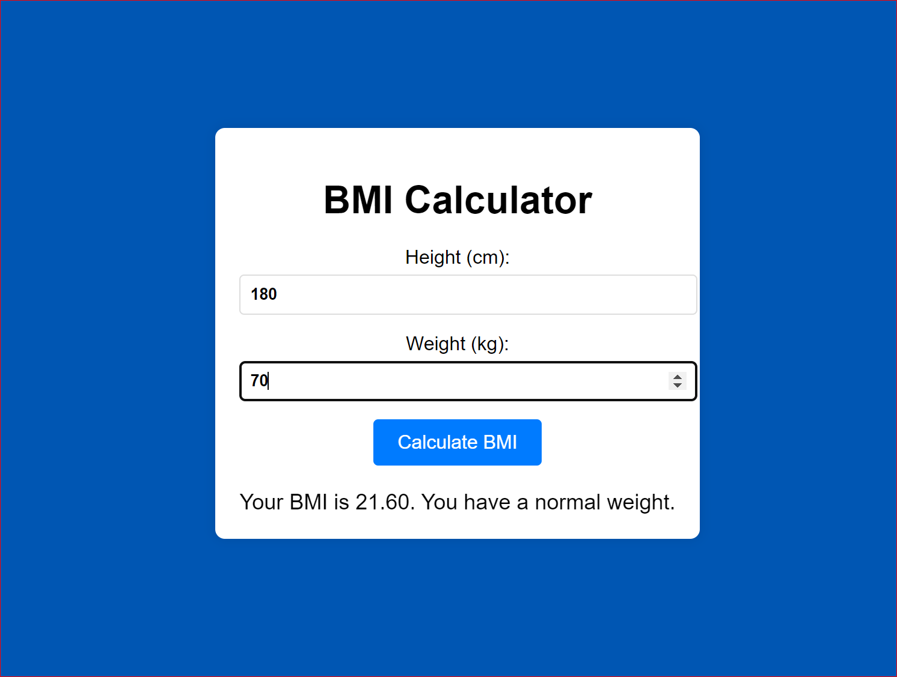

# BMI Calculator

This is a simple BMI (Body Mass Index) Calculator web application built using HTML, CSS, and JavaScript. The application allows users to input their height and weight to calculate their BMI and determine their weight category.

## Technologies Used

- HTML
- CSS
- JavaScript

## Screenshot

